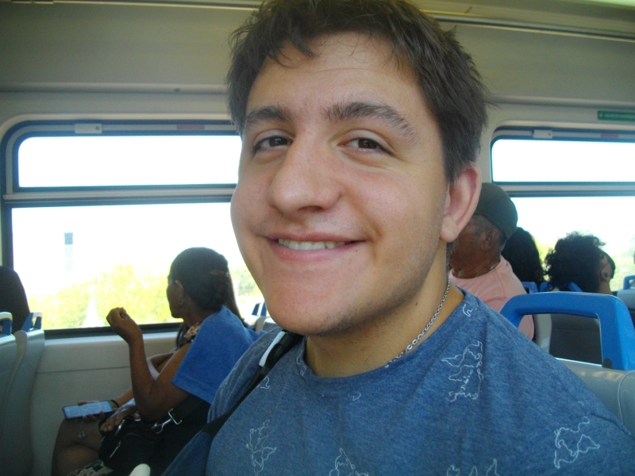

# Presentacion #

###  Datos personales ###
  * Nombre: Francisco Garcia
  * Legajo: 222.333-8
    

---
## Data adicional ##
Me gustan las nuevas tecnologias, jugar a la compu, la programacion y comer.

### Tema actual ###

**Computadoras** **cuanticas**
En resumen en vez de utilizar bits usan cúbits, que permiten tener mas de 2 estados.
Me gustaria ver como se continua  desarrollando esta tecnologia y estas nuevas 
computadoras logran hacer nuevos avances. [Un pequeño video de las computadoras cuanticas](https://www.youtube.com/watch?v=xymGpIeNc88)

<Felicidades enconctraste el ester egg. https://en.wikipedia.org/wiki/Easter_egg_(media)>
